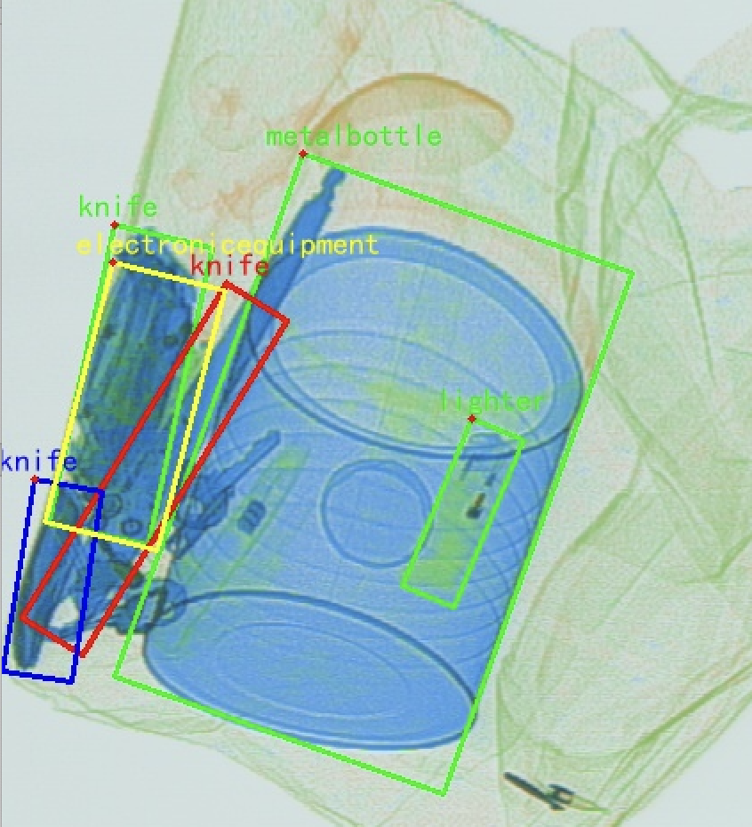
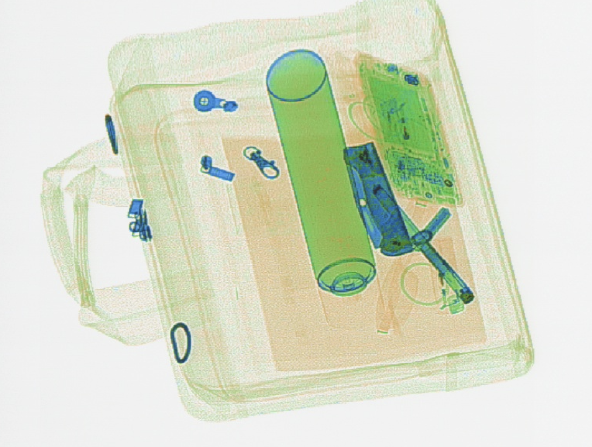
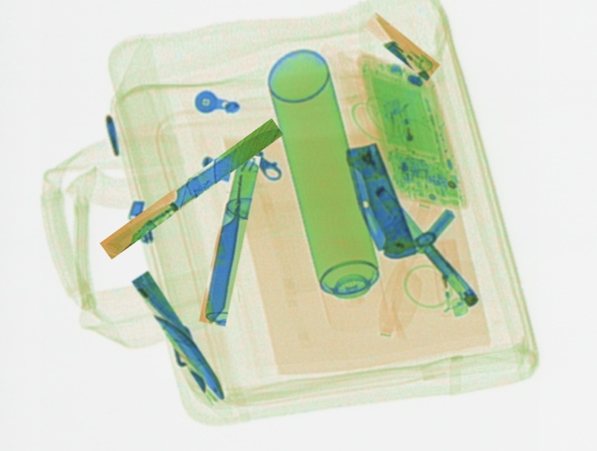

## This repository is the solution ranked at Top 10 in the [IJCAI 2023 Workshop Challenge](https://sites.google.com/view/glow-ijcai-23/challenge) "Generalizing from Limited Resources in the Open World" with Track II of Rotated Detection competition, implemented based on "Large Selective Kernel Network for Remote Sensing Object Detection" at: [https://arxiv.org/pdf/2303.09030.pdf](https://arxiv.org/pdf/2303.09030.pdf). The original repo is here: [Large-Selective-Kernel-Network](https://github.com/zcablii/Large-Selective-Kernel-Network).


## Introduction

Base on existing amazing work, some new features and toolkits used for oriented obeject detection task are implemented. Most of them are borrowed from horizontal object detection task but originally they are not supportive for rotated object detection task. I believe these newly introduced toolkits and features could be helpful and easily used in other rotated object detection tasks executed based on MMRotate codebase of version 2.xx. All the configuration files used in the competition are placed at `./configs/IJCAI/`

### Toolkits

* Convert the competition official annotation format to DOAT format: `./tools/convert_ijcai2dota.py`
* Convert the required submit format to official annotation format: `./tools/convert_submit2ijcai.py`
* Split data into k folds: `./tools/kfold_split.py`
* Visulisation DOTA style annotated data: `./tools/dota_vis.py` 
* Rotate objects offline for data augmentation: `./tools/data_aug_offline.py`
* Rescale rotated objects offline for data augmentation: `./tools/im_rescale.py`
* Inspect the checkpoint shape and size: `./tools/inspect_checkpoint.py`
* Substitute original detector weight with a new backbone ckpt weight: `./tools/merge_ckpt.py`
* Merge and average several checkpoints: `./tools/model_ensamble.py`
* Crop rotated objects for classification model training: `./tools/obj_crop.py`
* Visulize the predicted false positive, false negative and true positive objects: `./tools/results_analysis.py`. An example is shown below (partially cropped from original image to avoid copyright problem), where green boxes are tp, red boxes are fp, blue boxes are fn:
<div style="display: flex; justify-content: center;">
    
</div>
* Crop the false positive and false negative objects: `./tools/get_fp_fn.py`
* Copy-paste augmentation skill with rotated objects: `./tools/copy_paste.py`. A comparison is shown as following(left is a crop patch from training data, right is the augmented version with several random rotated knifes pasted on it):
<div style="display: flex; justify-content: center;">
    
    
</div>
### New Features
* SWA: [reference config](configs/IJCAI/lsk_s_ema_fpn_1x_dota_le90_swa.py)
* Rotated Mosaic: [reference config](configs/IJCAI/lsk_s_ema_fpn_1x_dota_le90_mosaic.py)
* CARAFE FPN: [reference config](configs/IJCAI/lsk_s_ema_fpn_1x_dota_le90_caraf.py)
* Rotated GenericRoIExtractor: [reference config](configs/IJCAI/lsk_s_ema_fpn_1x_dota_le90_allroi.py)
* TTA: [reference config](configs/IJCAI/lsk_s_ema_fpn_1x_dota_le90_tta.py)
* K folds training: [reference config](configs/IJCAI/lsk_s_ema_fpn_1x_dota_le90_k_fold.py)

## Models

Imagenet 300-epoch pre-trained LSKNet-T backbone: [Download](https://download.openmmlab.com/mmrotate/v1.0/lsknet/backbones/lsk_t_backbone-2ef8a593.pth)

Imagenet 300-epoch pre-trained LSKNet-S backbone: [Download](https://download.openmmlab.com/mmrotate/v1.0/lsknet/backbones/lsk_s_backbone-e9d2e551.pth)

Imagenet 300-epoch pre-trained LSKNet-M backbone: [Download](https://pan.baidu.com/s/1o-tTYRLP_1RFyU94HHsPjQ)  提取码: iq3s

Finetuned 100ep on target 9 competition classes LSKNet-M backbone: [Download](https://pan.baidu.com/s/1vEsZojR9dLb2cBLdGdV0AA)  提取码: roov

Finetuned 100ep on target 9 competition classes LSKNet-S backbone: [Download](https://pan.baidu.com/s/1TQueNb_g4W8H3Pev79o6ng) 提取码: 0aa9
## Method & Solution
 TODO

## Installation

MMRotate depends on [PyTorch](https://pytorch.org/), [MMCV](https://github.com/open-mmlab/mmcv) and [MMDetection](https://github.com/open-mmlab/mmdetection).
Below are quick steps for installation.
Please refer to [Install Guide](https://mmrotate.readthedocs.io/en/latest/install.html) for more detailed instruction.

```shell
conda create --name openmmlab python=3.8 -y
conda activate openmmlab
git clone https://github.com/TUDelftHao/Large-Selective-Kernel-Network.git
git checkout -b IJCAI2023-workshop origin/IJCAI2023-workshop
cd Large-Selective-Kernel-Network
pip install -r custom_requirements.txt
pip install -v -e .
```

## Get Started

Please see [get_started.md](docs/en/get_started.md) for the basic usage of MMRotate.
We provide [colab tutorial](demo/MMRotate_Tutorial.ipynb), and other tutorials for:

- [learn the basics](docs/en/intro.md)
- [learn the config](docs/en/tutorials/customize_config.md)
- [customize dataset](docs/en/tutorials/customize_dataset.md)
- [customize model](docs/en/tutorials/customize_models.md)
- [useful tools](docs/en/tutorials/useful_tools.md)


## Acknowledgement

MMRotate is an open source project that is contributed by researchers and engineers from various colleges and companies. We appreciate all the contributors who implement their methods or add new features, as well as users who give valuable feedbacks. We wish that the toolbox and benchmark could serve the growing research community by providing a flexible toolkit to reimplement existing methods and develop their own new methods.


## License

This project is released under the [Apache 2.0 license](LICENSE).
